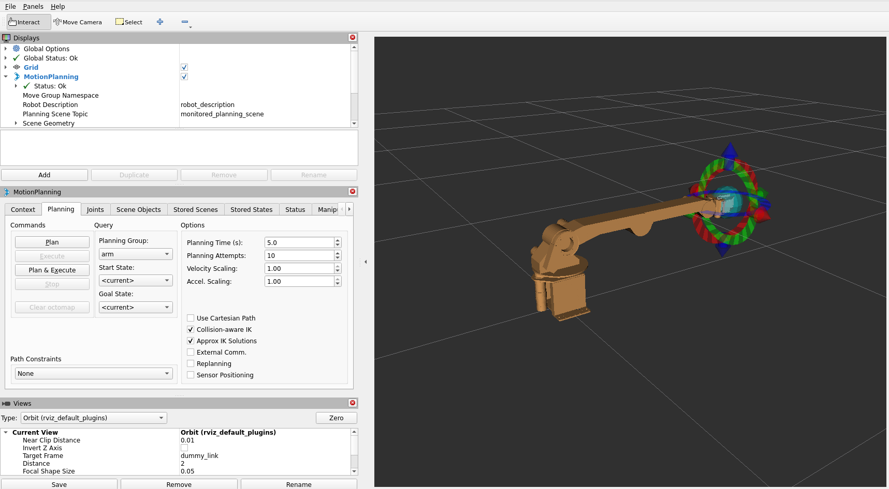

*Read this in other languages: [English](README.en.md) |  [日本語](README.md).*

# AMIR 740 Robotic Manipulator ROS 2 Packages

<p align="center">
  
</p>

This repository contains ROS 2 packages for controlling AMIR 740 robot.

# Table of Contents
<!-- TOC -->

- [AMIR 740 Robotic Manipulator ROS 2 Packages](#amir-740-robotic-manipulator-ros-2-packages)
- [Table of Contents](#table-of-contents)
  - [Requirements \& Environment](#requirements--environment)
  - [Packages](#packages)
  - [Installation](#installation)
  - [Usage](#usage)
  - [License](#license)

<!-- /TOC -->

## Requirements & Environment
- AMIR 740:
  - Product page: [https://www.vstone.co.jp/products/amir740/index.html](https://www.vstone.co.jp/products/amir740/index.html)
  - Buy AMIR 740 here: [https://www.vstone.co.jp/robotshop/index.php?main_page=product_info&products_id=5348](https://www.vstone.co.jp/robotshop/index.php?main_page=product_info&products_id=5348)
- Ubuntu Linux - Jammy Jellyfish (22.04)
- ROS 2 Humble Hawksbill


## Packages

- `amir` : AMIR 740 metapackage
- `amir_bringup` : A package that collects together the scripts, launch files, and dependencies that are required to bring the AMIR 740 robot into a running state.
- `amir_description` : A package that contains mesh files for displaying AMIR.
- `amir_driver` : A package that provides a driver for controlling AMIR 740 with ROS 2 Control.
- `amir_interfaces` : A package that contains message definitions for interfacing with AMIR 740 robot.
- `amir_moveit_config` : A package that provides MoveIt configuration for AMIR 740.


## Installation

1. Install ROS 2 Humble on your system by following the instructions [here](https://docs.ros.org/en/humble/Installation.html).
2. Clone this repository into your workspace:
```bash
mkdir -p ~/ros2_ws/src
cd ~/ros2_ws/src
git clone -b $ROS_DISTRO https://github.com/vstoneofficial/amir740_ros.git
rosdep install -r --from-paths . --ignore-src --rosdistro $ROS_DISTRO -y
```
3. Build your workspace:
```bash
cd ~/ros2_ws
colcon build --symlink-install
```
4. Source your workspace:
```bash
source ~/ros2_ws/install/setup.bash
```
5. Install micro-ROS Agent: (only reqired for connecting with real hardware)
```bash
cd ~/ros2_ws
git clone -b $ROS_DISTRO https://github.com/micro-ROS/micro_ros_setup.git src/micro_ros_setup
rosdep update && rosdep install --from-paths src --ignore-src -y
colcon build
source install/local_setup.bash

ros2 run micro_ros_setup create_agent_ws.sh
ros2 run micro_ros_setup build_agent.sh
source install/local_setup.bash
```

## Usage

- To display robot in RViz, run:
```bash
ros2 launch amir_description display.launch.py
```


- To launch MoveIt's "demo" mode, run:
```bash
ros2 launch amir_moveit_config demo.launch.py
```


- To launch the bringup files and controlling the real robot with MoveIt, run:
  > **Note**\
  > updating AMIR 740 firmware is required, please refer to document for more details
```bash
# First terminal
ros2 run micro_ros_agent micro_ros_agent serial --dev /dev/ttyUSB0 -v6

# Second terminal
ros2 launch amir_bringup amir_moveit.launch.py
```

## License

This project is licensed under the Apache License - see the [LICENSE](LICENSE) file for details.
