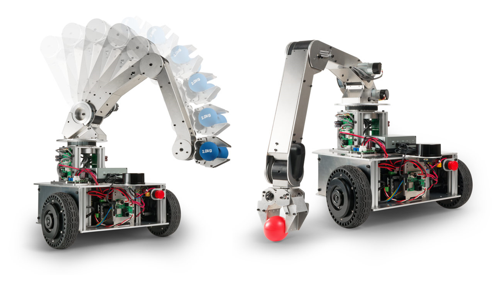
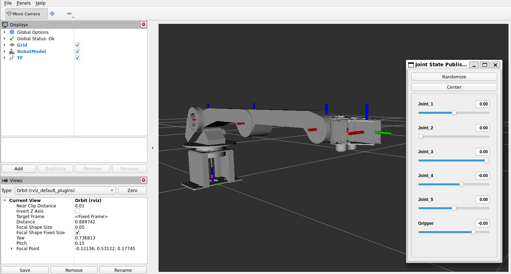
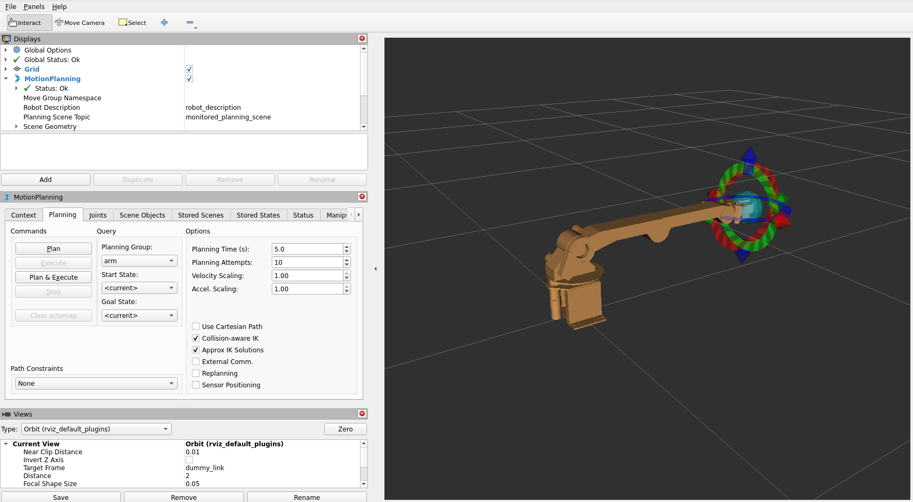

*Read this in other languages: [English](README.en.md) |  [日本語](README.md).*

# AMIR 740 台車用ロボットアーム ROS 2 パッケージ

<p align="center">
  
</p>

ヴイストン株式会社より発売されている台車用ロボットアーム「AMIR 740」をROS 2で制御するためのパッケージです。別途Linux搭載のPC及びロボット実機が必要になります。


# Table of Contents
<!-- TOC -->

- [必要機器 & 開発環境](#%E5%BF%85%E8%A6%81%E6%A9%9F%E5%99%A8--%E9%96%8B%E7%99%BA%E7%92%B0%E5%A2%83)
- [パッケージ内容](#%E3%83%91%E3%83%83%E3%82%B1%E3%83%BC%E3%82%B8%E5%86%85%E5%AE%B9)
- [インストール方法](#%E3%82%A4%E3%83%B3%E3%82%B9%E3%83%88%E3%83%BC%E3%83%AB%E6%96%B9%E6%B3%95)
- [利用方法](#%E5%88%A9%E7%94%A8%E6%96%B9%E6%B3%95)
- [ライセンス](#%E3%83%A9%E3%82%A4%E3%82%BB%E3%83%B3%E3%82%B9)

<!-- /TOC -->

## 必要機器 & 開発環境
- AMIR 740:
  - 製品ページ: [https://www.vstone.co.jp/products/amir740/index.html](https://www.vstone.co.jp/products/amir740/index.html)
  - 販売ページ: [https://www.vstone.co.jp/robotshop/index.php?main_page=product_info&products_id=5348](https://www.vstone.co.jp/robotshop/index.php?main_page=product_info&products_id=5348)
- Ubuntu Linux - Jammy Jellyfish (22.04)
- ROS 2 Humble Hawksbill

## パッケージ内容

- `amir` : AMIR 740メタパッケージ。
- `amir_bringup` : AMIR 740の実機ロボットを操作するために必要なスクリプト、ランチファイル、および依存関係のパッケージ。
- `amir_description` : AMIRの表示に必要なメッシュファイルを含むパッケージ。
- `amir_driver` : ROS 2 ControlでAMIR 740を制御するためのドライバーパッケージ。
- `amir_interfaces` : AMIR 740ロボットとの通信のためのメッセージ定義を含むパッケージ。
- `amir_moveit_config` : AMIR 740用のMoveIt構成に関連するパッケージ。

## インストール方法

1. [こちら](https://docs.ros.org/en/humble/Installation.html)の手順に従って、ROS 2 Humbleをインストールしてください。
2. このリポジトリをワークスペースにクローンしてください:
```bash
mkdir -p ~/ros2_ws/src
cd ~/ros2_ws/src
git clone -b $ROS_DISTRO https://github.com/vstoneofficial/amir740_ros.git
rosdep install -r --from-paths . --ignore-src --rosdistro $ROS_DISTRO -y
```
3. ワークスペースをビルド:
```bash
cd ~/ros2_ws
colcon build
```
4. ワークスペースのオーバレイ作業:
```bash
source ~/ros2_ws/install/setup.bash
```
5. 「micro-ROS Agent」をインストール: (実機を動かす場合のみ必要)
```bash
cd ~/ros2_ws
git clone -b $ROS_DISTRO https://github.com/micro-ROS/micro_ros_setup.git src/micro_ros_setup
rosdep update && rosdep install --from-paths src --ignore-src -y
colcon build
source install/local_setup.bash

ros2 run micro_ros_setup create_agent_ws.sh
ros2 run micro_ros_setup build_agent.sh
source install/local_setup.bash
```

以上で`amir740_ros`パッケージのセットアップは完了です。

## 利用方法

- RViz上でAMIR 740のモデルを表示する場合, 以下のコマンドで立ち上げます:
```bash
ros2 launch amir_description display.launch.py
```


- MoveItの「デモ」モードを起動するには、以下のコマンドを実行してください：
```bash
ros2 launch amir_moveit_config demo.launch.py
```


- 「bringup」ファイルを起動し、MoveItで実際のロボットを制御するには、以下のコマンドを実行してください：
  > **Note**\
  > AMIR 740のファームウェアを更新する必要があります。詳細については、ドキュメントを参照してください。
```bash
# First terminal
ros2 run micro_ros_agent micro_ros_agent serial --dev /dev/ttyUSB0 -v6

# Second terminal
ros2 launch amir_bringup amir_moveit.launch.py
```

## ライセンス

このプロジェクトはApacheライセンスの下でライセンスされています。詳細については[LICENSE](LICENSE)ファイルを参照してください。
