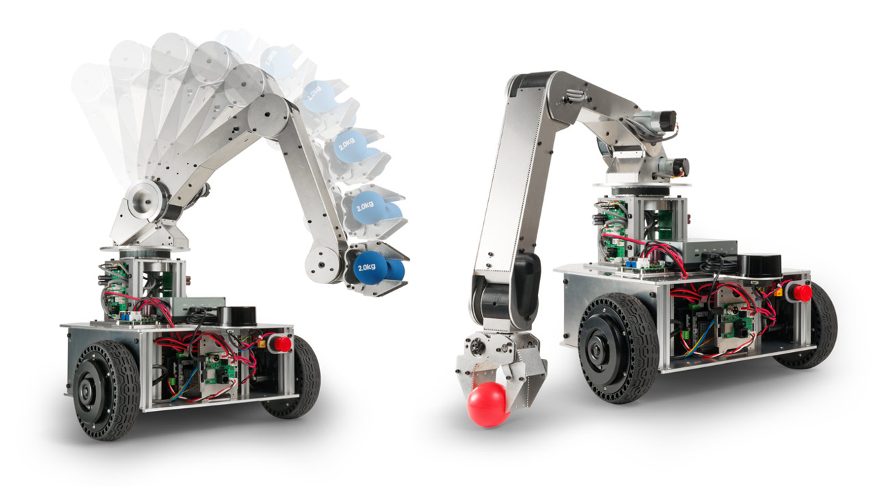
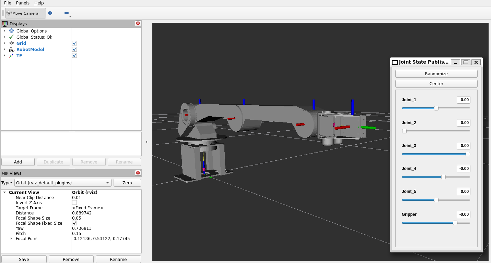
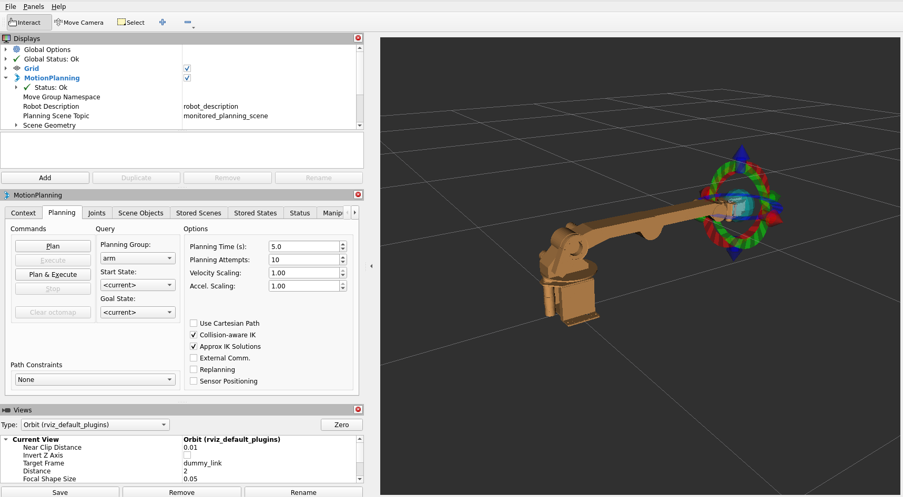

*Read this in other languages: [English](README.en.md) |  [日本語](README.md).*

# AMIR 740 台車用ロボットアーム ROS 2 パッケージ

<p align="center">
  
</p>

ヴイストン株式会社より発売されている台車用ロボットアーム「AMIR 740」をROS 2で制御するためのパッケージです。別途Linux搭載のPC及びロボット実機が必要になります。


# 目次
<!-- TOC -->

- [必要機器 & 開発環境](#必要機器--開発環境)
- [ファイルの構成](#ファイルの構成)
- [パッケージ内容](#パッケージ内容)
- [インストール方法](#インストール方法)
- [使用方法](#使用方法)
  - [URDFモデルの表示](#urdfモデルの表示)
  - AMIR 740（実機）との通信**: ROS 2とMicro-ROSを統合するためのエージェントノードを起動。
    - [有線シリアル接続の場合](#有線シリアル接続の場合)
    - [Wi-Fi 接続の場合](#wifi-接続の場合)
  - [ロボットアームをROS 2経由で遠隔操作](#ロボットアームをros-2経由で遠隔操作)
  - [Gazeboシミュレータ](#gazeboシミュレータ)
- [ライセンス](#ライセンス)

<!-- /TOC -->

## 必要機器 & 開発環境
- AMIR 740:
  - 製品ページ: [https://www.vstone.co.jp/products/amir740/index.html](https://www.vstone.co.jp/products/amir740/index.html)
  - 販売ページ: [https://www.vstone.co.jp/robotshop/index.php?main_page=product_info&products_id=5348](https://www.vstone.co.jp/robotshop/index.php?main_page=product_info&products_id=5348)
- Ubuntu Linux - Jammy Jellyfish (22.04)
- ROS 2 Humble Hawksbill

## ファイルの構成
   ```
    ros2_ws/src
    └ amir740_ros
　　　　├ amir
　　　　├ amir_bringup
　　　　├ amir_description
　　　　├ amir_driver
　　　　├ amir_interfaces
　　　　└ amir_moveit_config
   ```

## パッケージ内容

- `amir` : AMIR740メタパッケージ。
- `amir_bringup` : AMIR740の実機ロボットを操作するために必要なスクリプト、ランチファイル、および依存関係のパッケージ。
- `amir_description` : AMIRの表示に必要なメッシュファイルを含むパッケージ。
- `amir_driver` : ROS2 ControlでAMIR740を制御するためのドライバーパッケージ。
- `amir_interfaces` : AMIR740ロボットとの通信のためのメッセージ定義を含むパッケージ。
- `amir_moveit_config` : AMIR740用のMoveIt構成に関連するパッケージ。

## インストール方法

1. [こちら](https://docs.ros.org/en/humble/Installation.html)の手順に従って、ROS2 Humbleをインストールしてください。
2. [micro-ROS](https://micro.ros.org/) Agent のセットアップ: *(実機を動かす場合のみ必要)*

```bash
mkdir -p ~/uros_ws/src
cd ~/uros_ws/src
git clone -b $ROS_DISTRO https://github.com/micro-ROS/micro_ros_setup.git src/micro_ros_setup
cd ~/uros_ws
rosdep update && rosdep install --from-paths src --ignore-src -y
colcon build
source install/local_setup.bash

ros2 run micro_ros_setup create_agent_ws.sh
ros2 run micro_ros_setup build_agent.sh
source install/local_setup.bash
```

3. このリポジトリをワークスペースにクローンしてください:

```bash
mkdir -p ~/ros2_ws/src
cd ~/ros2_ws/src
git clone -b $ROS_DISTRO https://github.com/vstoneofficial/amir740_ros.git
rosdep install -r --from-paths . --ignore-src --rosdistro $ROS_DISTRO -y
```

4. ワークスペースをビルド:

```bash
cd ~/ros2_ws
colcon build --symlink-install
```

5. ワークスペースのオーバレイ作業:

```bash
source ~/ros2_ws/install/local_setup.bash
```

6. シェルを起動時にワークスペースがオーバーレイされるように設定します。

```bash
$ echo "source ~/uros_ws/install/local_setup.bash" >> ~/.bashrc 
$ echo "source ~/ros2_ws/install/local_setup.bash" >> ~/.bashrc
```


以上で`amir740_ros`パッケージのセットアップは完了です。

## 使用方法

このパッケージには、以下の主要な機能が含まれています。（詳細は各ファイルを確認してください）

### URDFモデルの表示 
以下のコマンドを実行して、amir740のURDFモデルを表示します。

```bash
ros2 launch amir_description display.launch.py
```


MoveItの「デモ」モードを起動するには、以下のコマンドを実行してください：
```bash
ros2 launch amir_moveit_config demo.launch.py
```



### AMIR 740（実機）との通信**: ROS 2とMicro-ROSを統合するためのエージェントノードを起動。
#### ● 有線シリアル接続の場合:
```bash
ros2 run micro_ros_agent micro_ros_agent serial --dev /dev/ttyUSB0 --baudrate 921600 -v4
```

####  ● Wi-Fi 接続の場合:
```bash
ros2 run micro_ros_agent micro_ros_agent udp4 --port 8888
```

### ロボットアームをROS 2経由で遠隔操作
MoveItを使用してロボットを操作するためのノードを起動。

```bash
ros2 launch amir_bringup amir_moveit.launch.py
```

### Gazeboシミュレータ
以下のコマンドでGazeboでAMIR 740のシミュレーションを起動します。
```bash
ros2 launch amir_moveit_config gazebo.launch.py
```
MoveItで操作するGazeboのシミュレーションは次のコマンドで立ち上げてください。
```bash
ros2 launch amir_moveit_config demo_gazebo.launch.py
```

## ライセンス

このプロジェクトはApacheライセンスの下でライセンスされています。詳細については[LICENSE](LICENSE)ファイルを参照してください。
