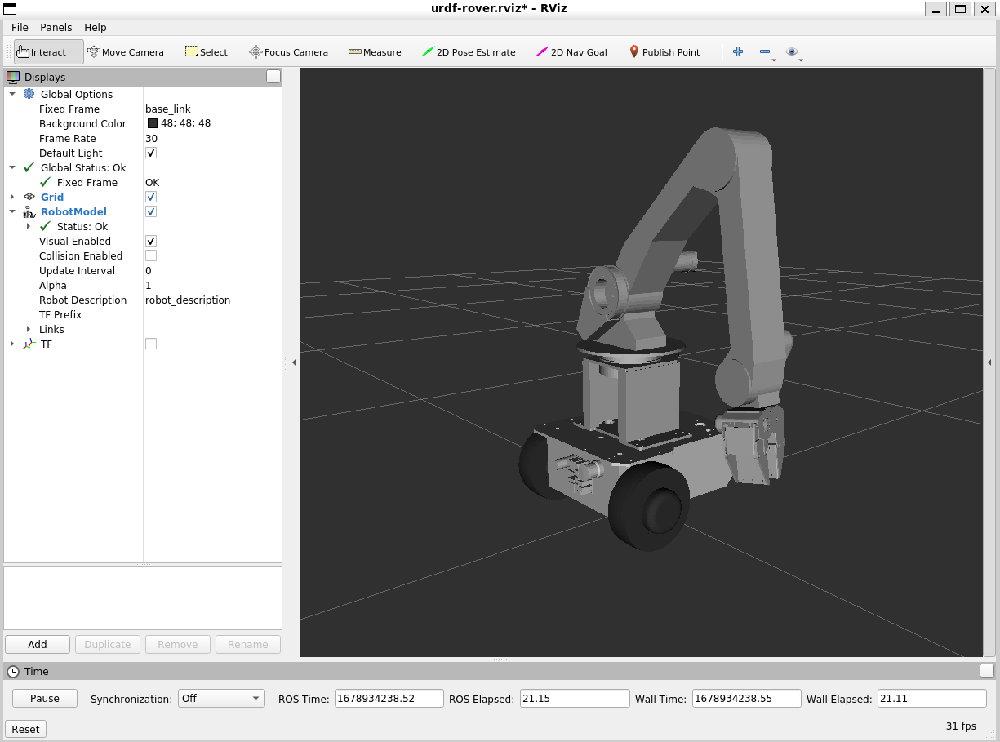
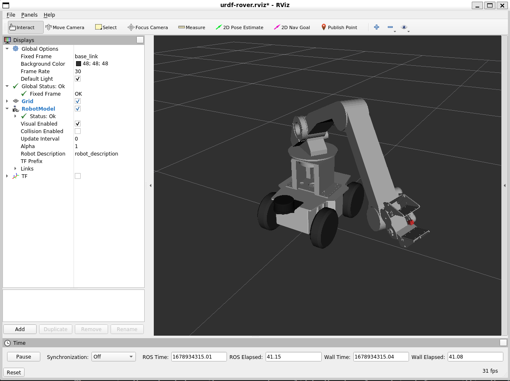

## AMIR 740 台車用ロボットアーム ROS対応SDK
ヴイストン株式会社より発売されている台車用ロボットアーム「AMIR 740」をROSで制御するためのSDKです。別途Linux搭載のPC及びロボット実機が必要になります。
AMIR 740については、製品ページをご覧ください。

## 目次
- [1 準備](#1-準備)
  - [1.1 依存パッケージのインストール](#11-依存パッケージのインストール)
  - [1.2 mimic_joint_pluginをインストール](#12-mimic_joint_pluginをインストール)
- [2 amir740_rosのセットアップ](#2-amir740_rosのセットアップ)
  - [2.1 catkin ワークスペースの作成](#21-catkin-ワークスペースの作成)
  - [2.2 サンプルパッケージのクローン](#22-サンプルパッケージのクローン)
  - [2.3 コードをビルド](#23-コードをビルド)
  - [2.4 オーバーレイ作業](#24-オーバーレイ作業)
- [3 各パッケージの説明と利用方法](#3-各パッケージの説明と利用方法)
    - [3.1 amir_control](#31-amir_control)
    - [3.2 amir_description](#32-amir_description)
    - [3.3 amir_motion](#33-amir_motion)
    - [3.4 amir_moveit_config](#34-amir_moveit_config)
      - [3.4.1 MoveIt](#341-moveit)
      - [3.4.2 Gazeboシミュレータ](#342-gazeboシミュレータ)
    - [3.5 f120a_arm_moveit_config](#35-f120a_arm_moveit_config)
    - [3.6 mecanum3_arm_moveit_config](#36-mecanum3_arm_moveit_config)
    - [3.7 mega3_arm_moveit_config](#37-mega3_arm_moveit_config)
    - [3.8 ros_control_boilerplate](#38-ros_control_boilerplate)
- [4 変更履歴](#4-変更履歴)
    - [v1.1.0 (2022-08-17)](#v110-2022-08-17)
    - [v1.0.0 (2022-07-14)](#v100-2022-07-14)

# 1 準備
ROSのインストール方法は[こちら](http://wiki.ros.org/noetic/Installation/Ubuntu)を確認してください。
## 1.1 依存パッケージのインストール
AMIR 740 のパッケージ構築のための依存パッケージをインストールします。
```bash
sudo apt install -y \
  ros-noetic-moveit \
  ros-noetic-moveit-visual-tools \
  ros-noetic-ros-control \
  ros-noetic-ros-controllers \
  ros-noetic-rosparam-shortcuts \
  ros-noetic-rqt-joint-trajectory-controller \
  ros-noetic-rosserial \
  ros-noetic-rosserial-arduino \
  libgflags-dev
```

## 1.2 mimic_joint_pluginをインストール
Gazebo上でAMIR 740を動作したい場合、グリッパを操作するための[mimic_joint_plugin](https://github.com/roboticsgroup/roboticsgroup_upatras_gazebo_plugins)が必要です。
```bash
git clone https://github.com/roboticsgroup/roboticsgroup_upatras_gazebo_plugins.git
```

# 2 amir740_rosのセットアップ
## 2.1 catkin ワークスペースの作成
[こちら](http://wiki.ros.org/catkin/Tutorials/create_a_workspace)のチュートリアルを参照し、catkinワークスペースを作成します。下記の内容はワークスペースのディレクトリを`~/catkin_ws`
とします。
## 2.2 サンプルパッケージのクローン
```bash
$ cd ~/catkin_ws/src
$ git clone https://github.com/vstoneofficial/amir740_ros.git
```
## 2.3 コードをビルド
```bash
$ cd ~/catkin_ws
$ catkin_make
```
## 2.4 オーバーレイ作業
```bash
echo "source ~/catkin_ws/devel/setup.bash" >> ~/.bashrc
```
既に`~/.bashrc`の中にある場合は、上記の操作をスキップして下記のコマンドを実行してください。
```bash
source ~/.bashrc
```

以上でamir740_rosパッケージのセットアップは完了です。\
次のコマンドを入力して、AMIR 740をRViz上に表示します。
```bash
roslaunch amir_description display.launch
```

# 3 各パッケージの説明と利用方法
### 3.1 amir_control
AMIR 740をROS Controlで制御するパッケージ。\
以下のコマンドでAMIR 740をROSと接続。
```
roslaunch amir_control rosserial.launch
```

以下のコマンドでAMIR 740をros_controlで制御する
```
roslaunch amir_control amir_control_HW.launch
```

### 3.2 amir_description
AMIR740のモデルを表示するためのパッケージ。\
以下のコマンドで立ち上げます。
```
roslaunch amir_description display.launch
```
以下の画面が表示します。


台車のモデルを表示したい場合は、以下のコマンドでリポジトリをクローンしてください
```bash
git clone https://github.com/vstoneofficial/megarover_description.git # メガローバーの場合
git clone https://github.com/vstoneofficial/mecanumrover_description.git　# メカナムローバーの場合
```

- メガローバーF120Aに取りつけた場合は
```bash
roslaunch amir_description display.launch rover_type:=f120a
```


- メガローバーVer3.0に取りつけた場合は
```bash
roslaunch amir_description display.launch rover_type:=mega3
```


- メカナムローバーVer3.0に取りつけた場合は
```bash
roslaunch amir_description display.launch rover_type:=mecanum3
```



実機をROSデバイスと接続した上で、下記のノードを立ち上げると、AMIR 740をGUI上のスライダで動作可能

```
rosrun amir_control joint_state_relay
```

> **Warning**\
> 実機のAMIR 740を接続した後、RViz画面上のポーズに動き出すので、十分注意してください。 

### 3.3 amir_motion
AMIR 740のサンプルモーション（MoveItへ指令を出すノード）のパッケージ。\
各ノードの詳細は`src`フォルダーの各ファイルに記載されています。

### 3.4 amir_moveit_config
AMIR 740　MoveItの設定パッケージ
#### 3.4.1 MoveIt
以下のコマンドでRViz上でMoveItを操作するデモを立ち上げてください。
```
roslaunch amir_moveit_config demo.launch
```

#### 3.4.2 Gazeboシミュレータ
以下のコマンドでGazeboでAMIR 740のシミュレーションを起動します。
```
roslaunch amir_moveit_config　gazebo.launch
```
MoveItで操作するGazeboのシミュレーションは次のコマンドで立ち上げてください。
```
roslaunch amir_moveit_config　demo_gazebo.launch
```

### 3.5 f120a_arm_moveit_config
メガローバー F120Aに搭載したAMIR 740 MoveItの設定パッケージ。\
以下のコマンドで立ち上げてください。
```
roslaunch f120a_arm_moveit_config demo.launch
```

ロボットの実機を動作する場合
```
roslaunch f120a_arm_moveit_config demo.launch moveit_controller_manager:=ros_control
```
### 3.6 mecanum3_arm_moveit_config
メカナムローバー Ver3.0に搭載したAMIR 740 MoveItの設定パッケージ。\
以下のコマンドで立ち上げてください。
```
roslaunch mecanum3_arm_moveit_config demo.launch
```

ロボットの実機を動作する場合
```
roslaunch mecanum3_arm_moveit_config demo.launch moveit_controller_manager:=ros_control
```

### 3.7 mega3_arm_moveit_config
メガローバー Ver3.0に搭載したAMIR 740 MoveItの設定パッケージ。\
以下のコマンドで立ち上げてください。
```
roslaunch mega3_arm_moveit_config demo.launch
```

ロボットの実機を動作する場合
```
roslaunch mega3_arm_moveit_config demo.launch moveit_controller_manager:=ros_control
```

### 3.8 ros_control_boilerplate
ROS_controlのハードウェアインターフェイスをセットアップするためのテンプレート。\
詳しくは、[こちら](https://github.com/PickNikRobotics/ros_control_boilerplate)を参照してください。

# 4 変更履歴
### v1.1.0 (2022-08-17)
- Gazeboシミュレータ機能を実装
- AMIR 740の物理的パラメータの調整
- グリッパのジョイント名の変更

### v1.0.0 (2022-07-14)
- 初版