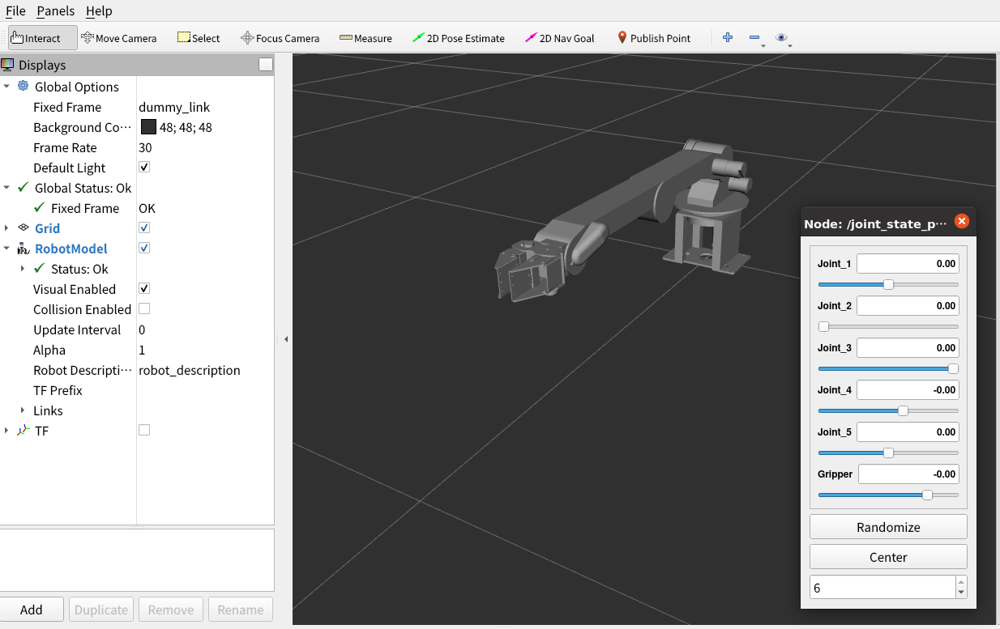
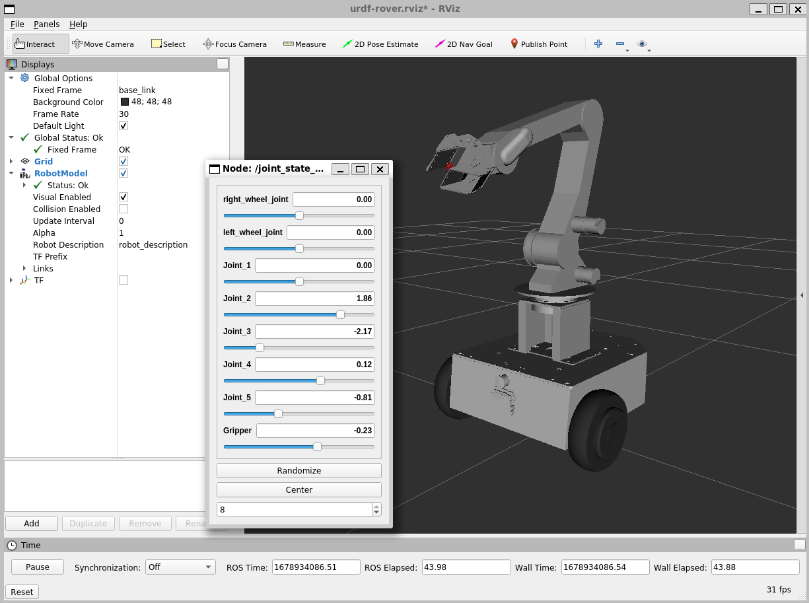
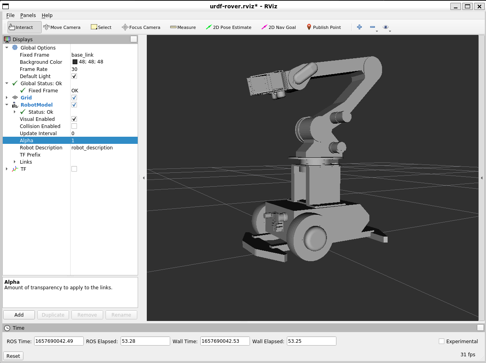
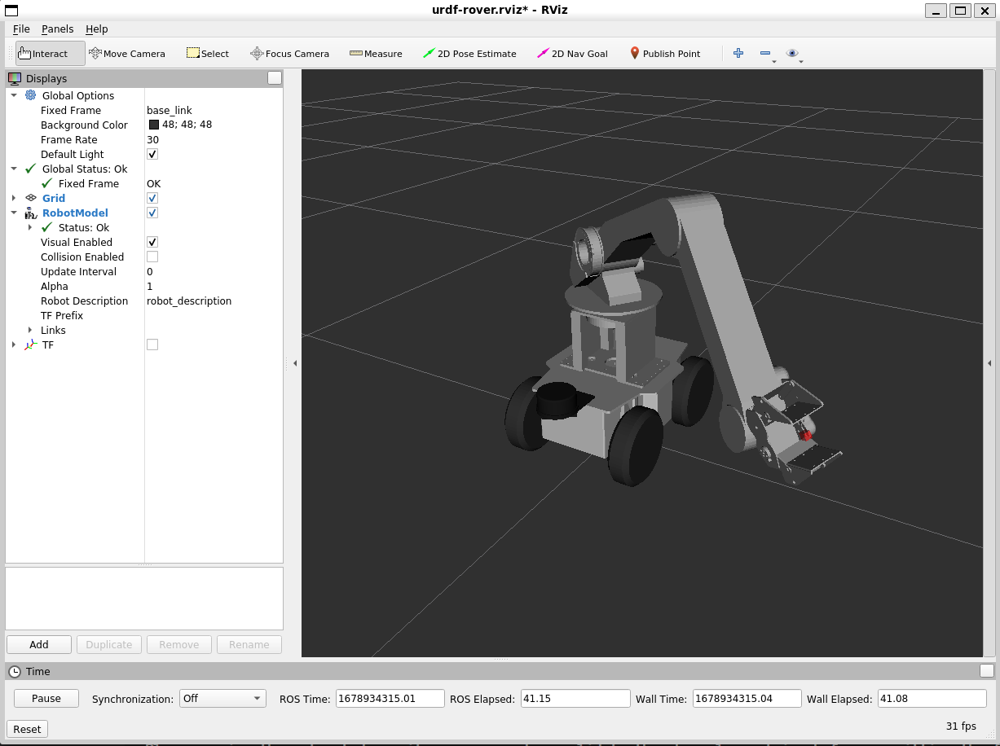

# AMIR 740のモデルを表示するためのパッケージ

以下のコマンドで立ち上げます。
```
roslaunch amir_description display.launch
```
以下の画面が表示します。


台車のモデルを表示したい場合は、以下のコマンドでリポジトリをクローンしてください
```
git clone https://github.com/vstoneofficial/megarover_description.git # メガローバーの場合
git clone https://github.com/vstoneofficial/mecanumrover_description.git　# メカナムローバーの場合
```

メガローバーF120Aに取りつけた場合は
```
roslaunch amir_description display.launch rover_type:=f120a
```


メガローバーVer3.0に取りつけた場合は
```
roslaunch amir_description display.launch rover_type:=mega3
```


メカナムローバーVer3.0に取りつけた場合は
```
roslaunch amir_description display.launch rover_type:=mecanum3
```



実機をROSデバイスと接続した上で、下記のノードを立ち上げると、AMIR 740をGUI上のスライダで動作可能

```
rosrun amir_control joint_state_relay
```


> **Warning**
> 実機のAMIR 740を接続した後、RViz画面上のポーズに動き出すので、十分注意してください。 